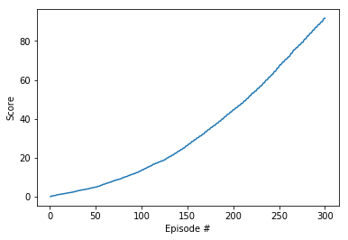

# DDPGContinuousControl
Deep Deterministic Policy Gradient for Continuous Control

# Training Multiple Agents To Solve A Continuous Control Task Using Deep Deterministic Policy Gradient

## Goal
For this toy example, the problem is to solve in UNITY ML environment the task of letting 20 robotic arms each keep control of its ball as it pushes the ball around.

First, let's define some terminology.

The world we address is defined as a Markovian Decision Process MDP with states s, action a, reward r and the conditional Probability P
of future state s' given current state s, action a, reward r and discount factor gamma.

**Environment**: The conditional distribution of the state transitions and the reward function constitute the model of the environment.

**Action**: set A of available move from a given state s to a state s'. Only the elements of the set A where P(s'|s,a) > 0 are considered. 

**Episode**: An episode is a complete sequence of events from an initial state to a final state.

**Terminal states**: The states that have no available actions are called terminal states.

**Cumulative reward**: The cumulative reward is the discounted sum of rewards accumulated throughout an episode.

**Policy**: A Policy is the agent’s strategy to choose an action at each state.

**Optimal policy**: the policy that maximizes the expectation of cumulative reward.

The problem is modeled as an episodic task during which the agents have to maximize the expected cumulative rewards.
Because we choose to model the solution as a DDPG algorithm, let us introduce its concept.

## DDPG algorithm concept
This is an algorithm that lies in between Value based methods and Policy based methods.
While actor function  specifies action a given the current state of the environment s, critic value function specifies a TD Error to criticize the actions made by the actor.

• Stochastic methods are of the form:    $$ {\pi_\theta(a|s) = \mathbb{P}[a|s;\theta$]}$$ 

• Deterministic methods are of the form: 

• Computing stochastic gradient requires more samples, as it
integrates over both state and action space. Deterministic gradient
is preferable as it integrates over state space only.

• In DQN, action was selected as: 

• Above equation is not practical for continuous action space. Using deterministic policy allows us to use:     

But,deterministic policy gradient might not explore the full state and action space. To overcome this, we introduce a noise process N:

This replaces the epsilon greedy algorithm of DQN for state and action space exploration.
We want to maximize the rewards (Q-values) received over the sampled mini-batch. The gradient is given as:

Applying the chain rule using mu instead of Q we get

This equation yields the maximum expected reward as we update the parameters using gradient ascent.

## DDPG Algorithm steps
These steps are borrowed from http://www.cs.sjsu.edu/faculty/pollett/masters/Semesters/Spring18/ujjawal/DDPG-Algorithm.pdf

<pre><code> </code></pre>
<pre><code> </code></pre>
<pre><code> </code></pre>
<pre><code> </code></pre>
<pre><code><pre><code> </code></pre></code></pre>
<pre><code><pre><code></code></pre></code></pre> 
<pre><code><pre><code> </code></pre></code></pre>
<pre><code><pre><code> </code></pre></code></pre>
<pre><code><pre><code> </code></pre></code></pre>
<pre><code><pre><code> </code></pre></code></pre>
<pre><code><pre><code> </code></pre></code></pre>
<pre><code><pre><code></code></pre></code></pre>
<pre><code><pre><code> </code></pre></code></pre>
<pre><code><pre><code> </code></pre></code></pre>
<pre><code><pre><code> </code></pre></code></pre>
<pre><code> </code></pre>
 

 

### Learning Algorithm:
The Q-Learning algorithm takes two steps:
1)	A sample step
2)	A learn step

To sample the environment a Multi Layer Perceptron is used to estimate the value actions based on environment observations.

Experience replay is used to reduce the oscillations of the output function of the network and accelerate the learning process by emphasizing the most meaningful samples. 
During the Learning step, a batch of past experiences is randomly sampled to train the agent.
The randomness of this experiences selection, helps also the learning process by reducing correlation between input samples. 

### Hyperparameters:
The parameters pertaining to the algorithms are

•	Replay buffer size: int(1e6)

•	Minibatch size: 64 

•	Discount factor: 0.99  

•	Learning rate actor : 1e-4

•	Learning rate critic : 3e-4

•	L2 Weight decay : 0.0001

•	Tau soft update of target parameters: 1e-3

•	epsilon init value, final value, update value

The parameters pertaining to the actor network are

• Number of layers and nodes: 1 input layer with 33 nodes, 2 hidden layers with 256 fully connected nodes, 1 output fully connected layer layer with 4 nodes.

• Activation function: hyperbolic tangent of ReLu

• The neural network optimizer: Adam optimizer and its parameters.

The parameters pertaining to the critic network are

• Number of layers and nodes: 1 input layer with 33 nodes, 2 hidden layers with 256 fully connected nodes,
1 hidden layer with 128 fully connected nodes,
 1 output fully connected layer layer with 1 node.

• Activation function: hyperbolic tangent of ReLu

• The neural network optimizer: Adam optimizer and its parameters.

### Actor Model Architecture:
The actor model architecture is defined by 5 variables:
State_size is the input dimensions of the network
Action_size is the output dimensions of the network 
Seed will initialize the weights of the network 
fc1_units and fc2_units are the number of nodes in the hidden layers of the network

The input layer has 33 nodes corresponding to position, rotation, velocity, and angular velocities of the arm. Each action is a vector with four numbers, corresponding to torque applicable to two joints – every action vector value is between \[-1, 1\].

The first hidden layer has 256 and the second 256 nodes. The output layer has four nodes one for each action.
Optimizing the number of nodes in the network leads to faster learning and better generalization.
By setting the number of hidden layers to two and using dichotomy node sampling, I eventually found that 40 hidden nodes on two hidden layers give better results than a larger network.

### Training:
The training runs for 300 episodes with 500-time steps per episode. When the average of the 100 most recent scores reaches 30 the problem is considered solved and the algorithm stops. 

A training episode is conducted as follows:
1)	Select the  most likely agent action given the current state and epsilon.
2)	Retrieve the environment response and update next state, reward and done flag
3)	Update the agent structure with present state, present action, reward and next state
4)	Update the state
5)	Update the reward

Every so episodes decrease the value of epsilon towards zero.

The scores achieved during the learning process are:

Episode 100	Average Score: 6.28

Episode 200	Average Score: 10.24

Episode 300	Average Score: 12.94

Episode 302	Average Score: 13.04

Environment solved in 202 episodes!	    Average Score: 13.04

End Score: 19.0

### Plot of Rewards

### Ideas For Future Work:
    There are may different ways this project can be improved. However, the problem we have to solve is simple and it is not warranted that
    resource hungry refinements are necessary in this case.
     The list of classical algorithms that could be tried includes double DQN, dueling DQN and prioritized experience replay.

